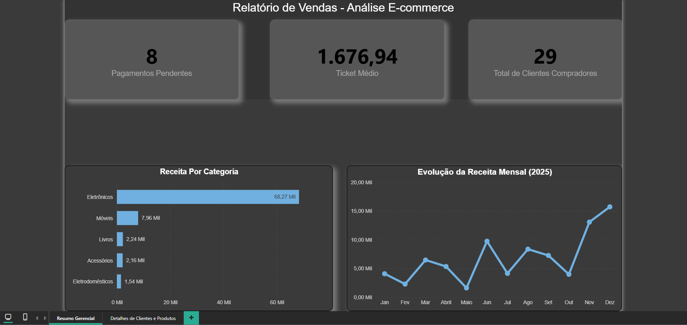
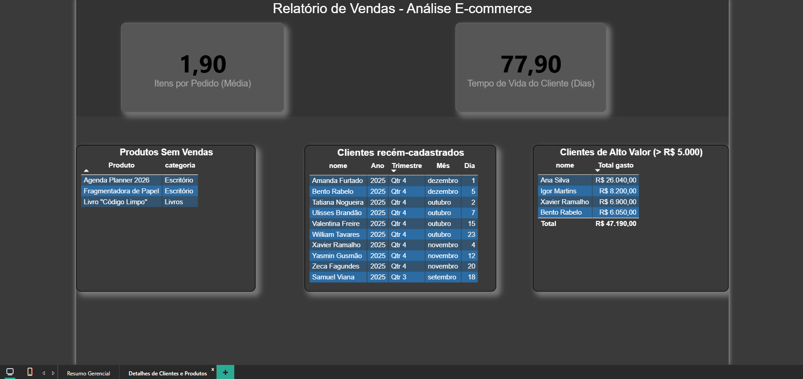

# Dashboard de Análise de Vendas para E-commerce

Este projeto apresenta uma solução de Business Intelligence de ponta a ponta para analisar o desempenho de um e-commerce fictício. Os dados foram modelados em um banco de dados MySQL e, em seguida, extraídos, transformados e visualizados no Power BI para gerar insights acionáveis.

### [Acesse o Dashboard Interativo Aqui](https://app.powerbi.com/links/JJm90Mh859?ctid=8dcbab28-0972-44db-bd18-6ab33bef9756&pbi_source=linkShare&bookmarkGuid=f513e763-274c-4b18-aacf-f4296bd3769f)

---

## Prévia do Relatório

### Página 1: Resumo Gerencial
*Visão geral dos principais KPIs e tendências de vendas.*

### Página 2: Detalhes de Clientes e Produtos
*Análise detalhada e listas operacionais para aprofundamento.*

---

## Ferramentas e Tecnologias Utilizadas

* **Banco de Dados:** MySQL
* **ETL & Análise de Dados:** SQL, Power Query
* **BI & Visualização de Dados:** Power BI
* **Cálculos e KPIs:** DAX
---

## Análises e KPIs Desenvolvidos

Este dashboard foi construído para responder a perguntas de negócio :

**Análises com SQL:**
* Vendas Totais por Categoria de Produto
* Receita Total por Mês
* Lista dos 10 Clientes Mais Recentes
* Identificação de Clientes de Alto Valor (> R$ 5k)
* Contagem de Pedidos com Status Pendente
* Lista de Produtos Sem Vendas

**KPIs Adicionais com DAX:**
* Cálculo do Ticket Médio por Pedido
* Contagem Total de Clientes Compradores
* Distribuição de Pedidos por Status
* Análise de Tempo de Vida do Cliente (dias entre cadastro e última compra)

---

## Como Executar o Projeto Localmente

1.  **Pré-requisitos:** Ter o MySQL Server e o Power BI Desktop instalados.

2.  **Banco de Dados:**
    * Crie um novo schema no seu MySQL.
    * Execute o script `criacao_bd.sql` que está na pasta `/sql_scripts`.

3.  **Power BI:**
    * Abra o Power BI e conecte-se ao seu banco de dados MySQL local.
    * Importe o modelo de dados completo (todas as 4 tabelas).
    * Com os dados carregados, você pode recriar os visuais e as métricas DAX.

